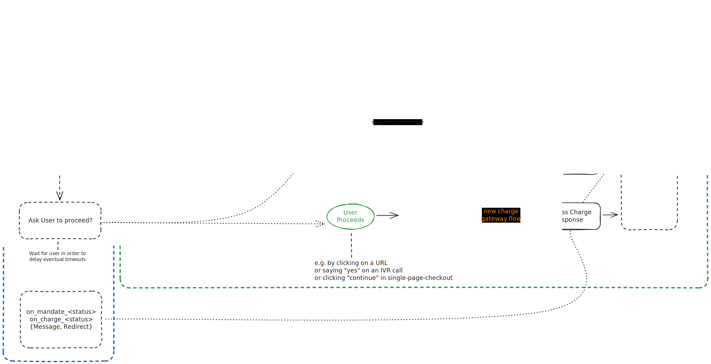
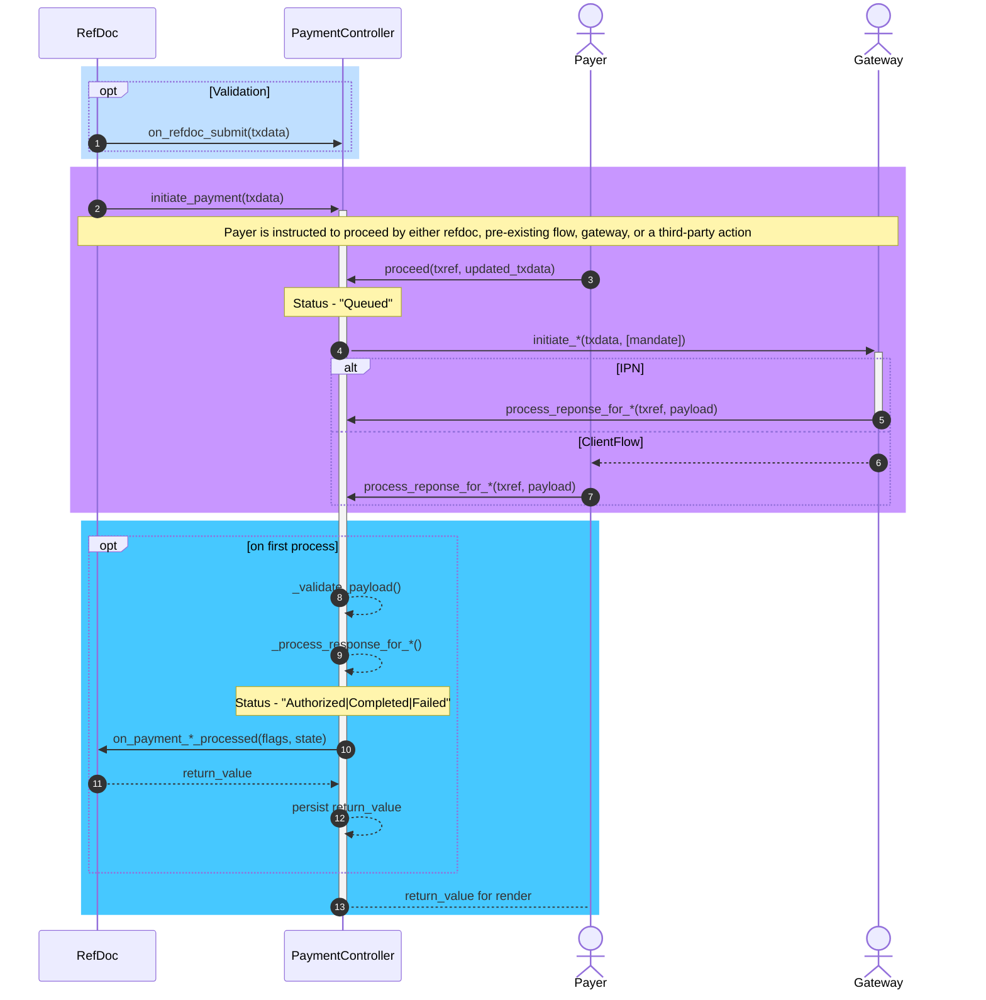

# Architecture

The Payment app provides an abstract payment controller and specific implementations for a growing number of gateways.
These implementations are located inside the _Payment Gateways_ module.

Inside the _Payment_ module, an additional _Payment Gateway_ DocType serves as the link target to a reference DocType (RefDoc, see below) for the respective payment gateway controller and settings. For example, the _Payment Request_ DocType links to this _Payment Gateway_ in order to implement its payment flow.

Furthermore, upon installation, the app adds custom fields to the Web Form for facilitating web form based payments and removes them upon uninstallation.

## Relation between RefDoc and Payment Gateway Controller

The reference document implements the surrounding business logic, links to the _Payment Gateway_, and hands over - typically on submit - to the specific payment gateway controller for initiating and handling the transaction.

After the transaction has been handled, the reference document may execute post-processing on the result and/or remit a specific payload (e.g., redirect link / success message) to the payment gateway controller in order to forward it to the client.

During the entire lifecycle of a payment, state is maintained on the _Integration Request_ DocType. It allows persisting free-form data and serves as a central log for interaction with remote systems.

### TX Data, TX Reference and Correlation ID

The data is passed from the RefDoc to the Payment Gateway Controller via a standardized data structure called _Req Data_.

Then, all transaction lifecycle state is stored into an _Integration Request_.

The _Name_ of the _Integration Request_ will be the system's unique _TX Reference_ to identify a payment transaction across its lifecycle and needs to be always passed around between the server, the client and remote systems. It may be typically stored in a gateway's request metadata in such a way that it is always returned by the remote server in order to reliably identify the transaction.

A payment gateway's _Correlation ID_, if available, is set as the _Integration Request_'s `request_id`. If a gateway uses it for fault-tolerant deduplication, a controller should send this ID to the remote server in any request throughout the remainder of a TX lifecycle.

If the remote server only returns a _Correlation ID_ but is unable to carry the _Integration Request_ name, then implementations can work around and recover the _Integration Request_ name, which is required by the controller methods, by filtering integration requests on `{"request_id": correlation_id}`.

### RefDoc Flow

1. Call the payment gateway controller's `on_refdoc_submission` hook with `tx_data` (for validation).
2. Call the payment gateway controller's `initiate_payment` method with `tx_data` and store the returned _Integration Request_ name on the RefDoc.
3. Call the payment gateway controller's `is_user_flow_initiation_delegated` method with `integration_request_name`.
4. If user flow initiation is not delegated (to the payment gateway): initiate/continue user flow, e.g., via Email, SMS, WhatsApp, Phone Call, etc.
5. post-process the payment status change via `on_payment_{mandate_acquisition,mandated_charge,charge}_processed` with a two-fold goal:
   - Continue business logic in the backend
   - Optional: return business-logic-specific `{"message": ..., "action": ..., "payload": ...}` to the payment gateway controller, where:
     - `message` is shown to the used
     - `action` is a client action, e.g. `{"redirect_to": "/my/special/path"}`
     - `payload` any custom payload that can be manipulated by the checkout page, usually `None`
     - If nothing is returned, the gateway's (if implemented) or app's standard is used

### Payment Gateway Controller Flow

The payment gateway controller flow has knowledge of the following flow variants:

- Charge: a single payment
- Mandate Acquisition: acquire a mandate for present or future mandated charges
- Mandated Charge: a single payment that requires little or no user interaction thanks to a mandate

A mandate represents some sort of pre-authorization for a future (mandated) charge. It can be used in diverse use cases such as:

- Subscription
- SEPA Mandate
- Preauthorized Charge ("hotel booking")
- Tokenized Charge ("one-click checkout")

Taking the flow variants into account, the high level control flow looks like this:

1. Eventually throw on `on_refdoc_submission` execution, if there's an issue.
2. Decide whether to initiate a Charge, a Mandate Acquisition, or a Mandated Charge. Mandate Acquisition is typically implemented as a pre-processing step of a Mandated Charge.
3. Initiate the flow via the dedicated method `initiate_payment` and a _TX Data_ appropriate for the selected flow.
3. Wait for the user GO signal (e.g., via link, call, SMS, click), then `proceed`. We delay remote interactions as much as possible in order to:
   - Initialize timeouts as late as possible
   - Offer the customer choices until the last possible moment (among others: mandate vs charge)
   - The controller can change the _TX Data_ with the user input
5. Manage the capturing user flow in collaboration with the payment gateway.
6. Process the result via the dedicated method `process_response_for_{charge,mandated_charge,mandate_acquisition}`:
   - Validate the response payload via `_validate_response_payload`, for example, check the integrity of the message against a pre-shared key.
7. Invoke the RefDoc's `on_payment_{mandate_acquisition,mandated_charge,charge}_processed()` method and manage the finalization user flow (e.g., via message and redirect).

### Schematic Overview

### Sequence Diagram

1. Validate
2. Initiate Payment: creates _Integration Request_
3. Payer gives GO signal through appropriate means (e.g., URL, IVR interaction, POS terminal)
4. Controller initiates the payment with the gateway
5. Flow yields a response payload to the controller: server-to-server variant
6. ditto: variant via client flow
7. ditto: variant via client flow
8. Validate payload integrity
9. Process the response and set the status
10. Hand over to business logic; passing read-only views of `self.flags` and `self.state`
11. Receive return value from business logic (e.g., success message / next action)
12. Persist return value (may come from controller processing, ref doc, or be a generic default)
13. Forward return value to the client for processing (e.g., render / execute action / etc.)

A server-to-server response from the gateway and a signed payload via the client flow may occur in parallel.

Thus, the blue area is only executed once (via a lock) and if it was already executed, the return value is simply read back.

This accommodates the case that the server-to-server response comes in first, yet the client flow can still process its useful return value: it joins (as in: "thread join") the client flow on the correct return value.

### And my Payment URL?

The payment URL is a well-known URL with a `ref` query parameter and the page at that URL can be used for capturing the user's GO signal to the Payment Gateway controller flow.

It is kept short, tidy, and gateway-agnostic as a means to impress succinct trustworthiness on the user.

Format: `https://my.site.tld/pay?ref=<TX Reference>`.

It is the responsibility of `/pay` to recover `TX Data` from the `TX Reference` and the corresponding gateway controller from the `integration_request_service` field of the _Integration Request_.

## Other Folders

All general utils are stored in the [utils](payments/utils) directory. The utils are written in [utils.py](payments/utils/utils.py) and then imported into the [`__init__.py`](payments/utils/__init__.py) file for easier importing/namespacing.

The [overrides](payments/overrides) directory has all the overrides for overriding standard Frappe code. Currently, it overrides the WebForm DocType controller as well as a WebForm whitelisted method.

The [templates](payments/templates) directory has all the payment gateways' custom checkout pages.

